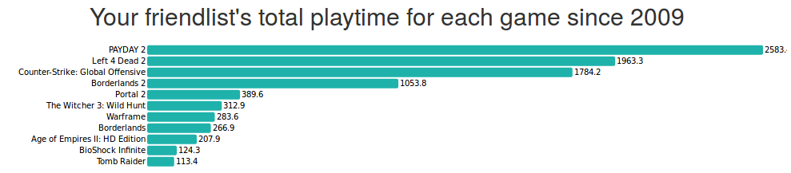
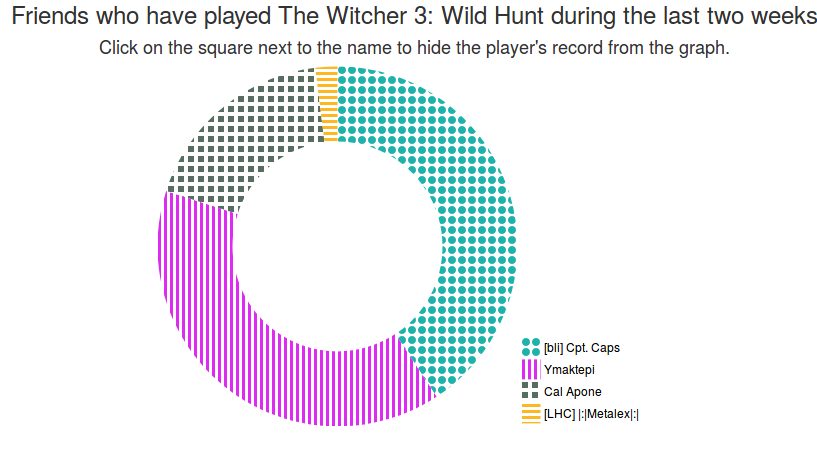
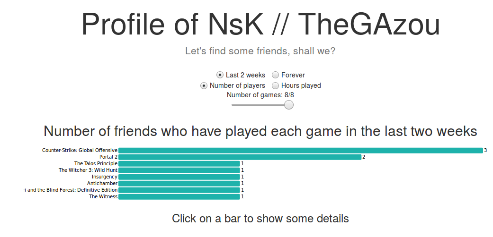
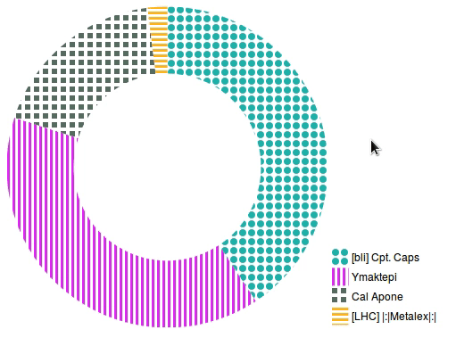
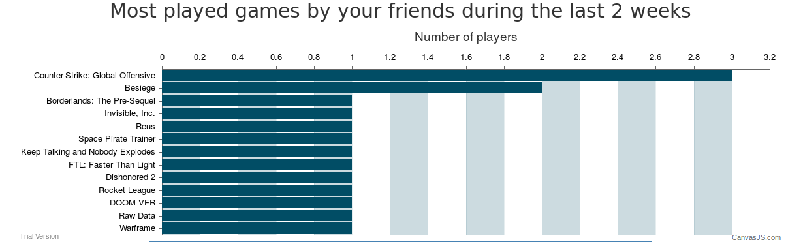

# SteamNetwork - Documentation

## ID's

To test the application you can use the following ids:
- thegazou
- rexf25
- 76561198001403248

## Data

We used the [Steam Web API](https://developer.valvesoftware.com/wiki/Steam_Web_API) to obtain the raw data for this project.

We did not use all the data from this API, we filtered them and kept two main objects:
- User
- Game

### User
Object describing an user.
#### Properties
- `steam_id`: integer
- `persona_name`: string, the user's dispay name
- `profile_url`: string
- `avatar`: string, url of the user's 184x184px profile picture
- `persona_state`: integer, The user's current status.
  - 0 - Offline
  - 1 - Online 
  - 2 - Busy
  - 3 - Away 
  - 4 - Snooze
  - 5 - looking to trade
  - 6 - looking to play
- `last_logoff`: integer, last time the user was online, in unix time
- `games`: list of simple game objects having the following properties:
  - `app_id`: integer, the id of the game, referring to a game object
  - `playtime_2_weeks`: integer, number of minutes the user played this game in the last two weeks
  - `playtime_total`: integer, number of minutes the user played this game since 2009 (begining of the game time record by steam)

### Game
Object describing a game.
#### Properties
- `app_id`: integer, id of the game
- `name`: string, name of the game
- `img_icon_url`: url of the game's icon
- `img_logo_url`: url of the game's logo

## Intention, Message to get through

The goal of the project is to find friends who consistently play games we own. Steam itself doesn't provide a tool that groups the gametime of each game you own, and you therefore must iterate through all your games to find which game is currently the most trendy.

## Representation

### First representation
At the beginning we wanted to have a global overview of the data set to gain an insight about it.

The first idea was to create a bubble chart graph with link between bubbles. Each bubble represents a friend with a game that you own, this idea came after exploring the [example](https://naustud.io/tech-stack/) of the [D3](https://github.com/d3/d3/wiki/Gallery) library.
This idea was abandoned at an early stage of the project because this representation was nicer than effective. In fact we doesn't know how to correlate the game and the friend in the bubble to have simple informations.

### Second representation
The next idea that we had was the chord diagram
  
[Source](https://bost.ocks.org/mike/uberdata/)  

This chord diagram represents the frequency of rides between various neighborhoods in San Francisco. The thickness of links be­tween neighborhoods encodes the relative frequency of rides between two neighborhoods: thicker links represent more frequent rides.

#### Adaptation for our application:
* The thickness of links be­tween users and games encodes the absolute playtime for a game. The thicker links represent more playtime. The thickness of links be­tween users is a constant value
Links are colored blue when it is a link between users and in orange when it is between users and games
* Links are not directed
* Blue nodes represent users. Orange nodes represent games
* We want to clearly separate users side from games side with a blank space

#### Critics
* **Positive**:
  * We can see everything on one screen
  * It is simple to interact with
* **Negative**:
  * There is no link between games
  * The thickness of the links between users and between users and games is different
  * Nodes encodes two different data which may be hard to distinguish
  * The avatar is not displayed

### Final representation
We then noticed we were focused on the "swag" parameter rather than the "use-case" one. Therefore we decided to simplify as much as we could the representation to fit the use-case better.

#### Bar char
We chose to represent the most trendy games amongst your friends using a bar chart. We could have only used a sorted list, but the bars give a faster insight about the playtime gaps between each games.

| Game | Playtime (h)    |
| :------------- | :------------- |
| PAYDAY2       | 2580       |
| Left 4 Dead 2       | 1960       |
| CS:GO       | 1780       |
| Borderlands 2      | 1050       |
| Portal 2      | 380      |
| Witcher 3      | 310      |
| Warframe      | 280      |
| Borderlands     | 260       |
| AoE 2: HD   | 200       |
| Bioshock Infinite     | 120       |
| Tom Raider     | 110       |

In this example, we see at the first glance at the bar chart that there is 1 game far from the others, and then two close ones. When we look at the list, we have to check all the numbers and their relations to get that same information.

At first, we wanted to have a color theme with 2 colors (grey and white, like the Steam client). We chose to change that and put the chart in another color so when the user looks at the page, he instantly distinguishes between the text and the graphs.

#### Pie chart
Now that the user can easily find trendy games and compare them, he still has to find which friends play them.  
Enters the pie chart.  
We also could have represented the friends that play each game with a list. Nonetheless, we chose to use a pie chart. It renders better the proportions than a simple list, and since we want to know who plays it more, it's the perfect representation for our present use-case.

We chose to combine textures and colors to encode the proportions. They are both useful if there are many games (more combinations) but this allows the colorblind people to use our application.

## Presentation and interaction

### Home Screen

The user can enter their steamID. The steam ID is one of the following:
- CustomURL
- 64 bits integer

If the user has changed their settings and added a custom URL, then they should use it as an identifier. If they haven't, then they have a default steamID which is an integer.

### Profile
Once they have entered their id, the user is sent to their profile.

#### Filters

The filters are placed at the top part of the profile.
- Time  
    The user can select the time frame for the bar graph.
    - 2 weeks  
        Only the last 2 weeks are used to draw the graph
    - Forever
        The graph shows the data from 2009
- Type of data
    The user can select which kind of data they want to see
    - Number of players
        The games are sorted using the number of friends who play them
    - Hours played
        The games are sorted according to the total time spent playing them by the user's friend list.
- Number of games
    The user can chose how many games they want to be displayed

#### Interactions
Once the data is displayed according to the user's parameters, the bars in the chart can be clicked to show a pie chart about the game. The pie chart is displayed under the bar chart.

The quarters in the pie chart can be _mouseover'd_ to display details about the friend. 

The quarters are also click-able and they show a new profile view about the friend.

## Improvements

### Better filter view 
Currently, the filters are stacked at the top of the page, and lack a title for each type of filter. We could clearly separate button groups and add a title.
### Textual description / Accessibility
Our website is at this point in time not ready for a blind person to visit. We could add textual description in the graphs, and add shortcuts to "show" the pie charts.
### Pie Chart Legend 
After some user review, we noticed that people wanted to click on the legend in the pie chart to show the user's profile.

### Responsiveness
We tried to make our website responsive but it lacks some finish. The titles are too large when viewing the site from mobile, and the legends for the pie chart are not well situated on the page.

### Details-on-demand
The application does not show all the information the Steam API gives us. We could add "cosmetic" informations to the pie chart's mouseover, such as the "online"/"offline" status, the number of games owned, ...
We also could add the games' logos to the bar chart.

### Profile sharing
We could add a profile sharing feature using the GET parameters of the URL. For instance, the route `/user/USERNAME?gameid=GAMEID` could show the piechart about the GAMEID for the user USERNAME.

### Caching 
Currently, the cache is only a hashmap in the Flask process. We tried to implement caching using redis and memcached but it did not turn out too well so the next step would be to make it work.

### Home screen
Our target users must know where to find their Steam ID, as we did not explain it very well. We could add some walk-through in a "help" section.

## Tools Review

### CanvasJS 
[CanvasJS](https://canvasjs.com/) was great for prototyping, you can easily enter your data, give a title, a mouseover, and standard information. But you can't customize everything, which is required in a Information Visualization project.

### D3.js

[D3js](https://d3js.org/) was finally chosen to draw both of the chart types. Since it is a tool that can easily be used to draw SVG pictures, you can fully customize your visualization.

For example, the main differences we could implement are:
- Fixed bar height in the bar chart
  - Canvas JS divides the total height of the canvas by the number of inputs, in such way that the canvas is rendered unreadable when there is many inputs.
- Customized textures for the bar chart.
- Value of the input at the right of the bars in the bar chart.
- Selecting friends in the pie chart.
- Separating the legend from the pie chart.
  - CanvasJS is a single object that can't be split.

  

